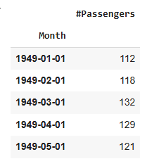
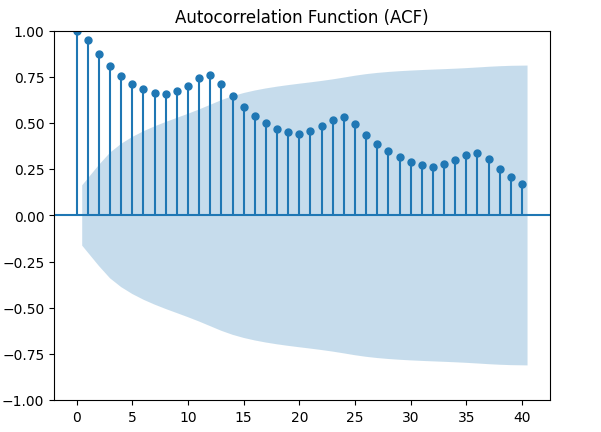
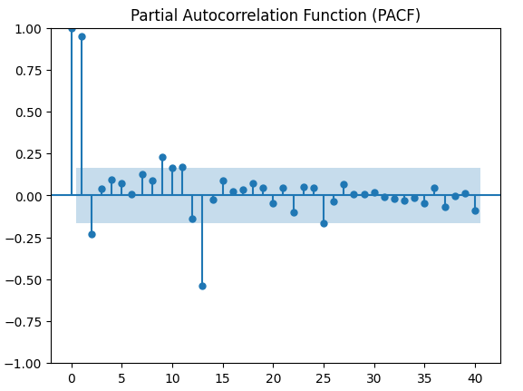
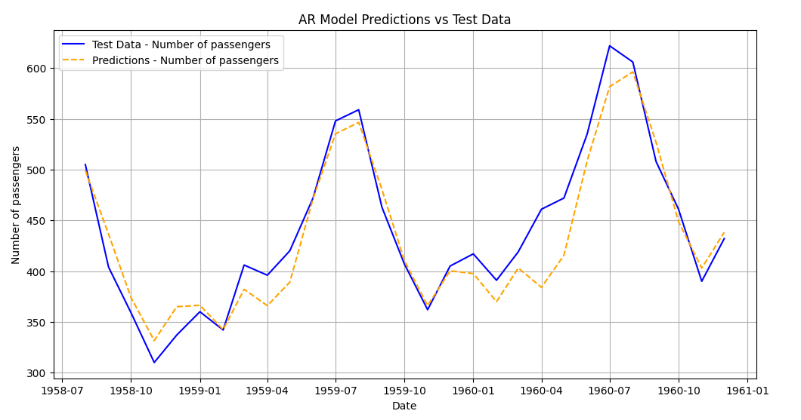

## Devloped by: Sreevalsan V
## Register Number: 212223240158
## Date: 8-03-2025

# Ex.No: 07                         AUTO-REGRESSIVE MODEL


### AIM:
To Implementat an Auto Regressive Model using Python
### ALGORITHM:
### ALGORITHM :

### Step 1 :

Import necessary libraries.

### Step 2 :

Read the CSV file into a DataFrame.

### Step 3 :

Perform Augmented Dickey-Fuller test.

### Step 4 :

Split the data into training and testing sets.Fit an AutoRegressive (AR) model with 13 lags.

### Step 5 :

Plot Partial Autocorrelation Function (PACF) and Autocorrelation Function (ACF).

### Step 6 :

Make predictions using the AR model.Compare the predictions with the test data.

### Step 7 :

Calculate Mean Squared Error (MSE).Plot the test data and predictions.

### PROGRAM

#### Import necessary libraries :

```python
import numpy as np
import pandas as pd
import matplotlib.pyplot as plt
from statsmodels.tsa.stattools import adfuller
from statsmodels.graphics.tsaplots import plot_acf, plot_pacf
from statsmodels.tsa.ar_model import AutoReg
from sklearn.metrics import mean_squared_error
```

#### Read the CSV file into a DataFrame :

```python
data = pd.read_csv('/content/AirPassengers.csv',parse_dates=['Month'],index_col='Month')
```

#### Perform Augmented Dickey-Fuller test :

```python
result = adfuller(data['#Passengers']) 
print('ADF Statistic:', result[0])
print('p-value:', result[1])
```

#### Split the data into training and testing sets :

```python
x=int(0.8 * len(data))
train_data = data.iloc[:x]
test_data = data.iloc[x:]
```

#### Fit an AutoRegressive (AR) model with 13 lags :

```python
lag_order = 13
model = AutoReg(train_data['#Passengers'], lags=lag_order)
model_fit = model.fit()
```

#### Plot Partial Autocorrelation Function (PACF) and Autocorrelation Function (ACF) :

```python
plt.figure(figsize=(10, 6))
plot_acf(data['#Passengers'], lags=40, alpha=0.05)
plt.title('Autocorrelation Function (ACF)')
plt.show()
plt.figure(figsize=(10, 6))
plot_pacf(data['#Passengers'], lags=40, alpha=0.05)
plt.title('Partial Autocorrelation Function (PACF)')
plt.show()
```

#### Make predictions using the AR model :

```python
predictions = model_fit.predict(start=len(train_data), end=len(train_data)+len(test_data)-1)
```

#### Compare the predictions with the test data :

```python
mse = mean_squared_error(test_data['#Passengers'], predictions)
print('Mean Squared Error (MSE):', mse)
```

#### Plot the test data and predictions :

```python
plt.figure(figsize=(12, 6))
plt.plot(test_data['#Passengers'], label='Test Data - Number of passengers')
plt.plot(predictions, label='Predictions - Number of passengers',linestyle='--')
plt.xlabel('Date')
plt.ylabel('Number of passengers')
plt.title('AR Model Predictions vs Test Data')
plt.legend()
plt.grid()
plt.show()

```

### OUTPUT:

Dataset:



ADF test result:


PACF plot:



ACF plot:



Accuracy:


Prediction vs test data:




### RESULT:
Thus we have successfully implemented the auto regression function using python.
